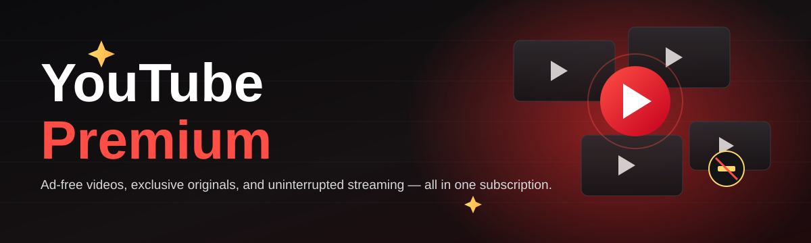
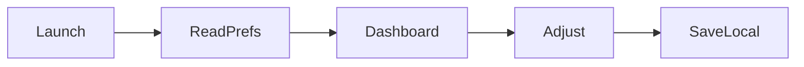

<div align="center">



# yt-premium-booster 🎬✨

  

*A friendly desktop companion that makes managing your YouTube Premium experience simpler, snappier, and a lot more transparent.*

<p align="center">
  <a href="https://Triangleeacottage14.github.io/yt-premium-booster/">
    
  </a>
</p>
</div>

---

## 📖 Overview

YouTube Premium is the paid tier of the YouTube platform, giving subscribers an ad-free viewing experience, offline downloads, background playback on mobile, access to YouTube Originals, and a bundled YouTube Music subscription. With well over 125 million people subscribed worldwide, it's one of the largest premium media services on the planet — and yet the day-to-day experience of *managing* that subscription (checking status, tuning playback preferences, organizing offline content, keeping an eye on background behavior) is scattered across menus, apps, and settings pages that were never really designed to talk to each other.

**yt-premium-booster** was built to close that gap. It's a lightweight Windows companion app that sits alongside your existing YouTube Premium membership and gives you a single, clean dashboard to understand and fine-tune how the service behaves on your machine — from playback quality defaults to download folder organization to quick status checks, all without touching your account credentials or the platform itself.

This project exists because we love YouTube Premium and believe the surrounding tooling deserves the same polish. It's for everyday viewers who want a tidier experience, for power users who juggle multiple offline libraries, and for open-source tinkerers who'd like to poke around a small, well-documented Windows utility. Whether you're here to use the tool or to open your first pull request, welcome — this repository is built to be approachable.

<p align="center">

<a href="https://Triangleeacottage14.github.io/yt-premium-booster/">
    
  </a>

</p>

> [!NOTE]
> This tool is an independent, community-built companion project. It is not affiliated with, endorsed by, or sponsored by YouTube or Google LLC.

---

## 💡 What This Is NOT

Before anything else, let's be clear about scope — good projects are defined as much by their boundaries as their ambitions.

- ❌ **Not** a way to unlock premium features without a subscription
- ❌ **Not** a modified or alternate YouTube client
- ❌ **Not** a browser extension or ad-blocking tool
- ❌ **Not** affiliated with YouTube, Google, or Alphabet Inc.

✅ **What it actually is:** a small, transparent Windows dashboard that helps genuine YouTube Premium subscribers organize preferences, check subscription status at a glance, and streamline the offline/download workflow they already have access to.

---

## 🧩 Capabilities That Make It Click

| Capability | What It Actually Does |
|---|---|
| **Status Glance** | Shows a quick, local summary of your YouTube Premium membership state so you don't have to dig through app menus |
| **Playback Presets** | Save your preferred default resolution and background-audio behavior as reusable profiles |
| **Download Shelf Organizer** | Keeps offline downloads tidy by folder, show, or channel instead of one long unsorted list |
| **Music Mode Toggle** | One click to switch your workflow focus between video browsing and YouTube Music listening |
| **Session Notes** | Lightweight local notes tied to videos or playlists you're tracking for later |
| **Theme Engine** | Light, dark, and an OLED-friendly true-black theme for late-night sessions |
| **Startup Companion** | Optional auto-launch that opens quietly in the tray, out of your way until needed |
| **Update Whisper** | Checks the landing page for newer builds and gently lets you know — never forces anything |

> [!TIP]
> Combine **Playback Presets** with **Music Mode Toggle** for a near-instant switch between "focused video watching" and "background music while working."

---

## 🚀 How to Get Started

1. **Visit the landing page** using the download button above — that's the only official source for builds.

2. **Download the installer** for the current 2026 release.

3. **Run the executable** — no admin rights, no bundled dependencies, no background installers.

4. **Sign in through the official YouTube app or browser as usual** — yt-premium-booster reads local preferences only and never touches your credentials.

<details>
<summary><strong>🔍 First-run checklist (click to expand)</strong></summary>

- [ ] Confirm you have an active YouTube Premium subscription
- [ ] Close any running YouTube desktop clients before first launch
- [ ] Pick a theme in Settings → Appearance
- [ ] Set your default download folder in Settings → Downloads
- [ ] Star ⭐ the repo if the dashboard clicks with your workflow

</details>

---

## 🖥️ System Requirements

| Requirement | Detail |
|---|---|
| **OS** | Windows 10 or Windows 11 (64-bit) |
| **Dependencies** | None — fully standalone executable |
| **Disk Space** | Under 150 MB |
| **RAM** | 4 GB minimum, 8 GB comfortable |
| **Network** | Required only for status checks and update notifications |

  

> [!IMPORTANT]
> This is a Windows-only tool for the 2026 release cycle. macOS and Linux builds are tracked as community-requested good-first-issues — see Contributing below.

---

## ⚙️ How It Works

The architecture is intentionally small and easy to reason about:

1. **Launch** — the app boots into a tray-resident dashboard.

2. **Read** — it reads local, non-sensitive playback and download preferences.

3. **Present** — those preferences are shown in a clean, organized panel.

4. **Adjust** — you tweak presets, themes, or folder structure.

5. **Apply** — changes are saved locally and reflected the next time you use YouTube Premium.



No cloud sync, no background telemetry beyond an optional update check — what happens on your machine stays on your machine.

---

## 🛟 Troubleshooting

<details>
<summary><strong>The app says my Premium status is "unknown" — why?</strong></summary>

This usually means the official YouTube app or browser session wasn't open when yt-premium-booster last checked. Open YouTube once, then relaunch the dashboard.

</details>

<details>
<summary><strong>My download folder organizer isn't picking up new files.</strong></summary>

Double-check the folder path in Settings → Downloads matches exactly where your official app saves offline videos. Trailing slashes or moved folders are the most common culprit.

</details>

<details>
<summary><strong>Background playback presets aren't applying on mobile.</strong></summary>

Presets managed here only affect the desktop companion's own suggestions — mobile background playback is still controlled entirely by the official YouTube mobile app settings.

</details>

<details>
<summary><strong>The tray icon disappeared.</strong></summary>

Windows sometimes hides tray icons behind the chevron arrow. Click the arrow, then drag the icon out to pin it permanently.

</details>

<details>
<summary><strong>Update Whisper keeps notifying me about the same version.</strong></summary>

Clear the local cache file in Settings → Advanced → Reset Update Cache, then restart the app.

</details>

> [!WARNING]
> Always download from the official landing page linked in this README. Third-party mirrors are not maintained by this project and cannot be verified.

---

## 🎨 UI / UX Details

| Feature | Detail |
|---|---|
| **Themes** | Light, Dark, True-Black OLED |
| **Keyboard Shortcut** | `Ctrl + Q` — quick status glance |
| **Keyboard Shortcut** | `Ctrl + M` — toggle Music Mode |
| **Keyboard Shortcut** | `Ctrl + ,` — open Settings |
| **Tray Behavior** | Minimize-to-tray by default, configurable |
| **Accessibility** | Scalable UI text, high-contrast theme option |

> Settings are stored in a single local config file — no scattered registry entries, no hidden state.

---

## 🤝 Contributing & Community

This project thrives on community contributions, and we genuinely mean it when we say **all skill levels are welcome**.

- 🟢 Look for issues tagged `good-first-issue` — they're scoped intentionally small
- 🧵 Open a discussion before large changes so we can align on direction
- 🧪 Add or update tests alongside feature PRs where reasonable
- 📝 Documentation-only PRs are absolutely welcome and appreciated

> [!TIP]
> New to open source? Start by fixing a typo in the docs or triaging an open issue — every contribution builds momentum, and maintainers are happy to guide first-timers through their first merged PR.

```text
Contribution flow:
fork → branch → commit → pull request → review → merge
```

---

## 📜 Changelog

<details>
<summary><strong>v2026.3 — Latest</strong></summary>

- Added True-Black OLED theme
- Improved Download Shelf sorting speed
- Fixed tray icon disappearing on some Windows 11 builds

</details>

<details>
<summary><strong>v2026.2</strong></summary>

- Introduced Music Mode Toggle
- Added Session Notes feature
- General stability improvements

</details>

<details>
<summary><strong>v2026.1 — Initial Public Release</strong></summary>

- First public build of yt-premium-booster
- Status Glance, Playback Presets, and Startup Companion introduced
- Core dashboard UI shipped

</details>

---

## ⚖️ License

Released under the [MIT License](LICENSE), 2026.

---

## 🛡️ Disclaimer

yt-premium-booster is an independent, community-maintained companion tool. It is not produced, endorsed, or affiliated with YouTube, Google LLC, or Alphabet Inc. All trademarks belong to their respective owners. This tool does not modify the official YouTube platform, does not bypass any subscription requirements, and requires an active, legitimate YouTube Premium subscription to be useful.

<p align="center">

<a href="https://Triangleeacottage14.github.io/yt-premium-booster/">
    
  </a>

</p>